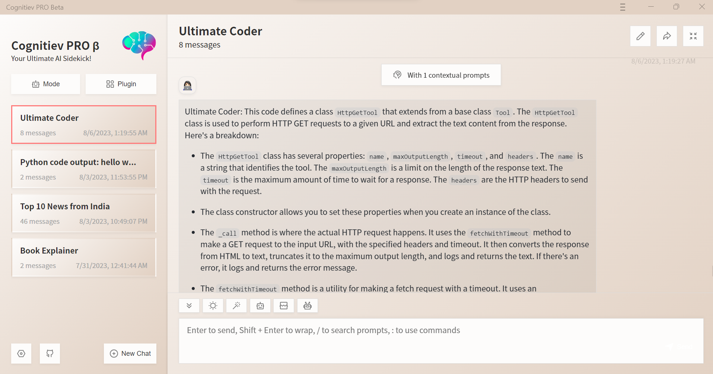

<h1 align="center">Cognitiev PRO β</h1>

## Features

- Privacy first, all data stored locally in the browser
- WebSearch with WebScraping functionality
- Markdown support: LaTex, mermaid, code highlight, etc.
- Responsive design, dark mode and PWA
- Fast first screen loading speed (~100kb), support streaming response
- New in : create, share and debug your chat tools with prompt templates (mask)
- Awesome prompts powered by [awesome-chatgpt-prompts](https://github.com/f/awesome-chatgpt-prompts)
- Automatically compresses chat history to support long conversations while also saving your tokens
- I18n: English, 简体中文, 繁体中文, 日本語, Français, Español, Italiano, Türkçe, Deutsch, Tiếng Việt, Русский, Čeština, 한국어

## What's New

- 🚀 v2.0 is released, now you can create prompt templates, turn your ideas into reality! Read this: [ChatGPT Prompt Engineering Tips: Zero, One and Few Shot Prompting](https://www.allabtai.com/prompt-engineering-tips-zero-one-and-few-shot-prompting/).

## LICENSE

   This repo originated from the awesome work by HK Gosuto in his [repo](https://github.com/Hk-Gosuto/ChatGPT-Next-Web-LangChain). And we tried to make it better in every way we can with our limited budget. Thus, for the components and parts that are still used from the source repo have the following license that is the same as the source repo:
   
[MIT](https://github.com/Hk-Gosuto/ChatGPT-Next-Web-LangChain/blob/main/LICENSE)
   
   
   For everything else that we added, changed, or improved from the parent repository is our proprietary, and our [Terms of Use](https://cognitiev.com/#terms will be final and binding for all parties. In case of any doubt please contact us at support@cognitiev.com 🧠
